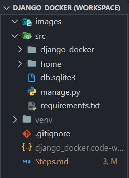
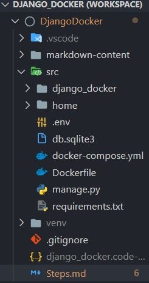

## Migrate a Django project to Docker on Window/Unix

### 1. Make Project

- Setup venv 

  ```python
  python -m venv venv
  ```

- Activate venv

  ```python
  .\venv\Scripts\activate
  ```

- install django and gunicorn.

  ``` python
  pip install django
  pip install gunicorn
  ```

- Make a django project and an app which return **'Hello Docker'** on home page.
- Initialize git and add the django project and exclude virtual env (venv).
- Make requirements.txt inside 'src' root folder of project
- Make project run and if every thing works fine make first commit.

<p align="center">
  
</p>

### 2. Make Docker Image

- Make change in DEBUG variable according to enviroment variable.
- Create a .env file and put DEBUG=True in it.
- Now run server not using `runserver` command but using `gunicorn` command (Only works in UNIX). For windows use `runserver`.

  ```python
  gunicorn django_docker.wsgi:application --bind 127.0.0.1:8000
  ```

- check the shortcoming in deployment using command

  ```python
  python .\manage.py check --deploy
  ```

- Make a Dockerfile without any extension and fill it with the given details in project root folder (along with manage.py)

  ```docker
  # Base Image whice we use to make docker image
  FROM python:3.9

  # make a dir to keep all code of project and mark it as working dir
  RUN mkdir /app
  WORKDIR /app

  # add current directory to working directory
  ADD . /app/

  # set environment variable and get them using os.environ.get()
  ENV PYTHONUNBUFFERED=1
  ENV DEBUG=False
  ENV PORT=8000 

  # copy requirements.txt to docker image file 
  COPY requirements.txt /app/requirements.txt
  # add command to run requirements.txt
  RUN pip install -r requirements.txt

  # copy remaining data from current dir to working dir
  COPY . /app/
  ```

- Add docker-compose.yml file in project root folder (along manage.py)

  ```docker
  version: "3.9"
    
  services:
    web:
      build: .
      command: python manage.py runserver 0.0.0.0:8000
      volumes:
        - .:/app
      ports:
        - "8000:8000"
  ```

- Build docker image (fire command from root folder - along manage.py)

  ```shell
  docker-compose build
  ```

  **or** (run this when inside directory of Dockerfile)

  ```shell
  docker build -t <DockerImageName> -f Dockerfile .
  ```

- This should end with output in the end something like (src is project folder name)

  ```shell
  Successfully built 4d99f19771b3
  Successfully tagged src_web:latest
  ```

- Run another command to up the server

  ```shell
  docker-compose up
  ```

  **or** (run from anywhere)

  ```shell
  docker run -it -p 8000:8000 <DockerImageName>
  ```


- Now we can access the django server at `127.0.0.1:8000` yes even though we made `runserver 0.0.0.0:8000` command we will access. Or if that does not work (when gunicorn is used) use `localhost` as URL.

### 3. Final Project Structure

<p align="center">
  
</p>

### 4. Save and Load

- Hit `docker images` in terminal and see what all images have been created. If you see the images of current project in list.

  ```shell
  REPOSITORY   TAG       IMAGE ID       CREATED       SIZE
  src_web      latest    bc397c326f67   2 hours ago   927MB
  python       3.9       2a93c239d591   6 days ago    885MB
  ```

- Save an docker image using these command

  ```shell
  docker save -o src_web.tar src_web
  >docker save -o python.rar python
  ```

- Ship these images to any machine and load the images there using command (be in same dir where images are)

  `In windows use .rar instead of .tar`

  ```shell
  docker load -i src_web.tar
  docker load -i python.tar
  ```

### 5. Hide sensitive info use `python-decouple` or `environment variable`

- install library using `pip install python-decouple` or refer [Documentation](https://pypi.org/project/python-decouple/).

- Keep sensitive data in `.env` file and Do not commit this `.env` file to source code repo. A example file `.env.example` similar to `.env` is included. To use it just rename it to `.env`.

- Location of `.env` file is in root folder (along manage.py)

- Data stored in `.env` can be accessed through `decouple` module as

  ```python
  SECRET_KEY = config('DJANGO_SECRET_KEY')
  DEBUG = config('DEBUG', default=False, cast=bool)
  ```

- `python-decouple` access the information in following order
  - Environment variables
  - Repository: ini or .env file
  - Default argument passed to config

- Later while deploying put these variables into system environment. Also way to access environment variables is:

  ```python
  import os

  SECRET_KEY = os.environ.get('SECRET_KEY')
  DEBUG = os.environ.get('DEBUG') == 'True'
  ```

##### That's All !!!
